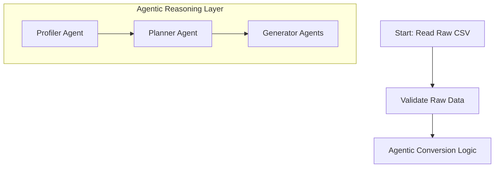

# Agentic ES Ingestion Pipeline 🚀

[](https://www.python.org/)
[](https://www.elastic.co/)
[](https://github.com/langchain-ai/langgraph)

## 📖 Overview

An advanced, agentic AI–driven data ingestion pipeline designed to transform diverse, non-standardized vendor data (primarily CSVs) into rigid, production-grade Elasticsearch JSON schemas. 

By leveraging **LangGraph** for orchestration and **GPT-5-mini** (via OpenAI) for reasoning, this system eliminates the need for manual, vendor-specific ETL scripts. It dynamically discovers schemas, generates transformation logic, and validates results against a strict central contract.

## ✨ Key Strategic Advantages

- 🤖 **Zero Engineering Effort**: Onboard new vendors without writing a single line of procedural code.
- 🧠 **Dynamic Orchestration**: Uses iterative state-machine logic (LangGraph) to handle complex, non-linear transformation tasks.
- 🛡️ **Schema-First Contract**: Guarantees Elasticsearch compatibility by enforcing schema definitions at the edge.
- 📈 **Scalable Execution**: Combines LLM-driven planning with deterministic Python execution for high-performance data processing.

## 🛠️ Technology Stack

- **Orchestration**: LangGraph
- **AI Core**: OpenAI GPT-5-mini (Agentic Reasoning)
- **Data Processing**: Pandas / Python
- **Search Engine**: Elasticsearch (ES)
- **Observability**: Slack Integration (Real-time pipeline status)

## 🏗️ Pipeline Architecture



## 🚀 Pipeline Stages (S1-S8)

1.  **S1: Read**: Ingests raw vendor files from `data/raw_csvs/`.
2.  **S2: Validate Raw**: Initial sanity checks on the incoming data structure.
3.  **S3: Agentic Convert**: The core reasoning step where agents (Profiler, Planner, Generator) map raw data to the ES schema.
4.  **S4: Validate Final**: Ensures the transformed data perfectly matches the target ES index requirements.
5.  **S5: Pull ES**: Retrieves current state from Elasticsearch to handle updates and deduplication.
6.  **S6: Compare**: Performs a diff between incoming data and current ES state.
7.  **S7: Report**: Generates a detailed audit log of changes, successes, and failures.
8.  **S8: Push ES**: Performs bulk indexing into Elasticsearch.

## 📂 Directory Structure

```text
.
├── agents/             # AI Agents (Profiler, Planner, Generator)
├── data/               
│   ├── raw_csvs/       # Input vendor files
│   └── schema/         # ES target schemas
├── executor/           # Deterministic code execution engines
├── graph/              # LangGraph orchestration logic
├── pipeline/           # Step-by-step pipeline modules (S1-S8)
├── observability/      # Monitoring and alerts (Slack)
├── config.py           # Configuration & Credentials
├── main.py             # Entry point
└── requirements.txt    # Dependencies
```

## ⚙️ Setup & Usage

1.  **Install Dependencies**:
    ```bash
    pip install -r requirements.txt
    ```

2.  **Configure Environment**:
    Update `config.py` with your OpenAI and Elasticsearch credentials.

3.  **Run the Pipeline**:
    ```bash
    python main.py
    ```
    *You will be prompted to enter the target index name (e.g., `products`, `vendors`).*
